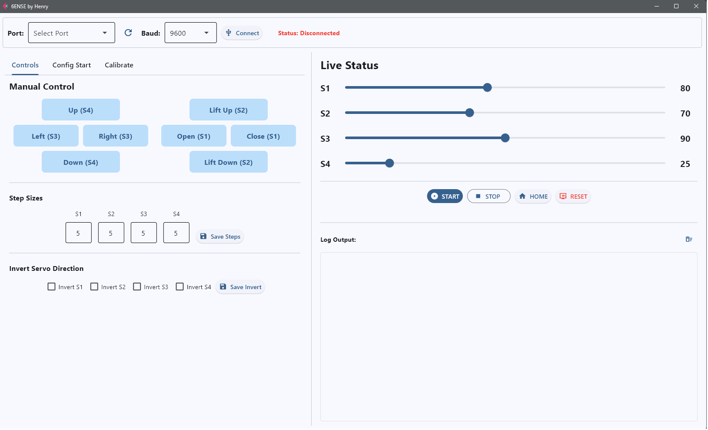

# 🤖 6ENSE: Automated Chemical Dipping Robotic Arm

An integrated hardware-software solution designed to automate chemical dipping processes for laboratory research. This project bridges the gap between chemical engineering and automation, significantly improving process consistency, operational efficiency, and safety when handling chemical substances.

---


## 🌟 Project Overview

This system consists of a **4-axis robotic arm** controlled via a custom-built Graphical User Interface (GUI). It allows researchers to easily configure dipping sequences, adjust angles, and set specific delays for multiple chemical beakers without needing to rewrite any code.

### 🔑 Key Capabilities

- **Custom Sequence Configuration**  
  Set start/end angles, number of beakers, and individual dipping delays (soaking time) for precise chemical reactions.

- **Smooth Multi-Axis Movement**  
  Integrated mathematical algorithms to synchronize servo movements (S2 & S4) for stable and smooth diagonal transitions.

- **Real-time Monitoring**  
  Live progress bar, estimated time remaining, and detailed system logs.

- **Manual Override & Calibration**  
  Fine-tune servo limits (Min/Max) and set safe "Home" positions directly from the software.

---


## 🛠️ Technology Stack

### 🔌 Hardware
- Arduino Uno R3
- UNO R3 Sensor Shield V5.0
- Switching Power Supply
- 4x Servos (Grip, Lift, Base, Neck)

### 💻 Software
- **Firmware:** C++ (Arduino IDE) for parsing serial commands and controlling precise PWM signals  
- **GUI:** Python (Flet framework - Flutter-based) for a modern, responsive user experience  

### 🔄 Communication
- Serial Communication (USB) at 9600 baud rate

---

## 📁 Repository Structure

```text
Chemical-Dipping-Robotic-Arm/
├── Arduino/                    # Arduino C++ Firmware
│   └── Board/Board.ino         # Main control logic for servos
├── Python_GUI/                 # Python Source Code
│   └── 6ENSE by Henry.py       # Flet GUI and Serial Worker logic
├── images/                     # Demo GIFs and assets
└── README.md
````
---

## 📦 Requirements

- Python 3.9+
- flet
- pyserial

Install dependencies via requirements file:

```bash
pip install -r requirements.txt
```
---

## 🚀 How to Run

### ✅ Option 1: Standalone Windows App (Recommended for Users)

You do not need to install Python or any dependencies to run this.

1. Go to the **Releases** section on the right side of this page
2. Download the `6ENSE by Henry.exe` file from the latest version (v1.0.0)
3. Connect the Arduino to your computer via USB
4. Run the `.exe` file
5. Select your COM Port and click **Connect**

---

### 🧑‍💻 Option 2: Run from Source (For Developers)

If you want to modify the code:

1. Clone this repository

```bash
git clone https://github.com/PhuwisWannaprapa/Chemical-Dipping-Robotic-Arm.git
```

2. Install the required Python libraries

```bash
pip install -r requirements.txt
```

3. Upload `Board.ino` to your Arduino

4. Run the Python script

```bash
python "Python_GUI/6ENSE by Henry.py"
```

---

## 👨‍🔬 Author

**Phuwis Wannaprapa**
* Chemical Engineering Graduate
* Process Optimization & Automation Enthusiast
* Connect with me on [LinkedIn](https://www.linkedin.com/in/phuwis-wannaprapa) | [My Portfolio](https://linktr.ee/phuwis.w)

```
```
